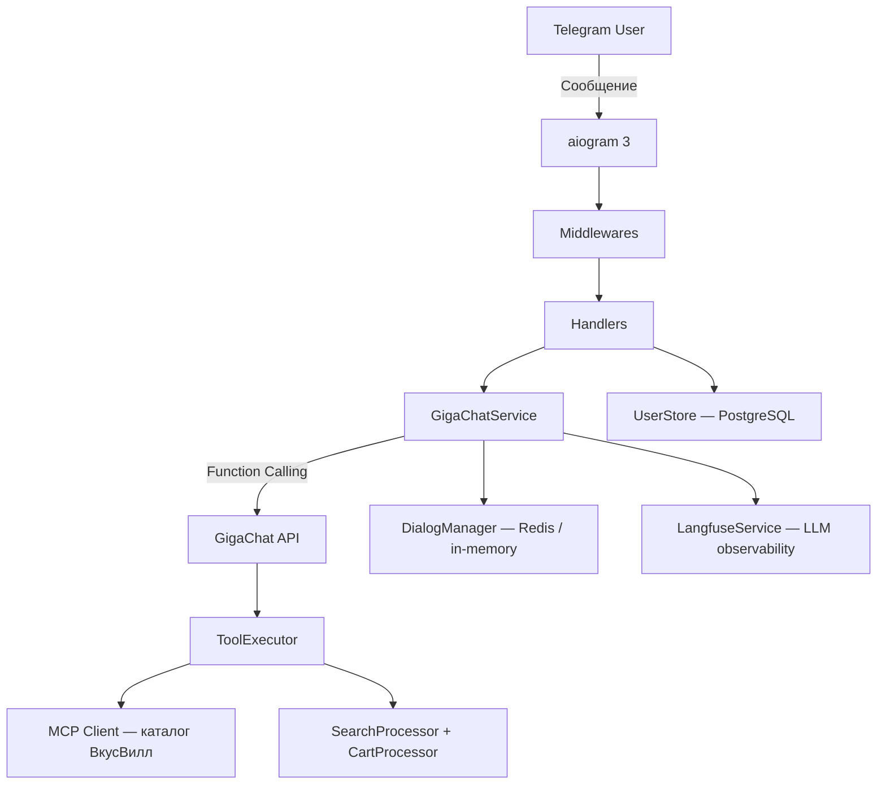

# VkusVill Bot

**Умный ИИ-ассистент для покупок в [ВкусВилл](https://vkusvill.ru)** — напиши, что хочешь купить, и бот соберёт корзину, используя естественный язык.

> **Demo:** [@vkuswill_bot](https://t.me/vkuswill_bot) — попробуй прямо сейчас!

[](https://github.com/mrPDA/vkuswill_bot/actions)
[](https://www.python.org/downloads/)
[](LICENSE)
[](https://github.com/astral-sh/uv)

<!-- TODO: добавить GIF-демо бота в действии -->

---

## Что умеет бот

- **Собирает корзину по запросу** — «Нужно молоко, хлеб и сыр на завтрак» — готовая ссылка на корзину ВкусВилл
- **Рецепты** — «Собери продукты для борща на 4 порции» — автоматический расчёт ингредиентов
- **Предпочтения** — «Я не ем мясо» — бот запомнит и учтёт при следующих поисках
- **КБЖУ и калорийность** — «Низкокалорийные снеки до 100 ккал» — фильтрация по составу
- **Планирование питания** — «План питания на 3 дня» — разнообразное меню с корзиной
- **Контекст диалога** — бот помнит разговор и понимает уточнения

### Пример

```
Пользователь: Нужно молоко, хлеб и масло

Бот: Нашёл и добавил в корзину:
  - Молоко пастеризованное 3,2% 0,93 л — 119 руб
  - Хлеб Бородинский нарезной 350 г — 69 руб
  - Масло сливочное 82,5% 180 г — 189 руб

  Итого: 377 руб
  Корзина готова: https://vkusvill.ru/cart/...
```

---

## Архитектура



**GigaChat** понимает запрос пользователя и через **function calling** вызывает инструменты: поиск товаров, сборка корзины, сохранение предпочтений. Интеграция с каталогом ВкусВилл работает через **MCP** (Model Context Protocol) — открытый стандарт для подключения LLM к внешним данным.

> Подробнее об архитектурных решениях — в статьях на Хабре (см. ниже).

---

## Технологии

| Компонент | Технология |
|-----------|-----------|
| Telegram-фреймворк | [aiogram 3](https://docs.aiogram.dev/) |
| ИИ-модель | [GigaChat-2-Max](https://developers.sber.ru/portal/products/gigachat) (Сбер) |
| Интеграция с ВкусВилл | [MCP](https://modelcontextprotocol.io/) (Model Context Protocol) |
| БД (пользователи) | PostgreSQL + asyncpg |
| БД (кеши) | SQLite (aiosqlite) |
| Кэш и сессии | Redis (опционально, fallback на in-memory) |
| LLM Observability | [Langfuse](https://langfuse.com/) (self-hosted) |
| Тестирование | pytest + pytest-asyncio (1231 тест) |
| CI/CD | GitHub Actions |
| Деплой | Docker + Kubernetes (Yandex Cloud) |
| Пакетный менеджер | [uv](https://docs.astral.sh/uv/) |

---

## Быстрый старт

### 1. Установка

```bash
git clone https://github.com/mrPDA/vkuswill_bot.git
cd vkuswill_bot
uv sync
```

### 2. Конфигурация

```bash
cp .env.example .env
```

Минимально нужны две переменные:

```bash
# Telegram Bot Token (получить у @BotFather)
BOT_TOKEN=your_telegram_bot_token

# GigaChat API (https://developers.sber.ru/portal/products/gigachat)
GIGACHAT_CREDENTIALS=your_gigachat_auth_key
```

PostgreSQL и Redis **не обязательны** для локальной разработки — бот автоматически использует in-memory хранилище и SQLite.

### 3. Запуск

```bash
# Через скрипт
./run.sh

# Или напрямую
uv run python -m vkuswill_bot
```

### Docker

```bash
# Всё окружение (бот + PostgreSQL + Redis + Langfuse + Metabase)
docker compose up -d
```

---

## Структура проекта

```
vkuswill_bot/
├── src/vkuswill_bot/           # Исходный код бота
│   ├── __main__.py              # Точка входа
│   ├── config.py                # Конфигурация (pydantic-settings)
│   ├── bot/                     # Handlers, middlewares
│   └── services/                # Бизнес-логика (GigaChat, MCP, корзина, поиск...)
├── tests/                       # 1231 тест (юнит, SAST, AI Safety)
├── migrations/                  # SQL-миграции PostgreSQL
├── infra/                       # Terraform (Yandex Cloud)
├── scripts/                     # Утилиты (deploy, metabase setup)
├── loadtests/                   # Нагрузочное тестирование (Locust)
├── .github/workflows/           # CI/CD pipelines
├── Dockerfile                   # Multi-stage production build
├── docker-compose.yml           # Локальная среда
└── pyproject.toml               # Зависимости (uv)
```

---

## Тестирование

```bash
make test              # Все тесты
make test-cov          # С покрытием
make test-security     # SAST + AI Safety
make lint              # Линтер (ruff)
```

Проект включает 1231 тест: юнит-тесты, SAST (секреты, опасные функции), AI Safety (prompt injection, jailbreak) и валидация входных данных.

---

## Команды бота

| Команда | Описание |
|---------|----------|
| `/start` | Приветствие и инструкция |
| `/help` | Справка по возможностям |
| `/reset` | Сбросить историю диалога |
| `/survey` | Пройти опрос и получить бонусные корзины |
| `/invite` | Реферальная ссылка для приглашения друзей |

---

## Серия статей на Хабре

Подробное описание архитектуры, решений и граблей — в серии статей:

| # | Статья | Тема |
|---|--------|------|
| 1 | *Скоро* | Демо и обзор — как бот собирает корзину по одному сообщению |
| 2 | *Скоро* | MCP + GigaChat — как подключить LLM к API ВкусВилл |
| 3 | *Скоро* | 11 граблей function calling на GigaChat |
| 4 | *Скоро* | Тестирование ИИ-бота: SAST, AI Safety, 98% покрытие |
| 5 | *Скоро* | Юнит-экономика Telegram-бота с ИИ |

> Ссылки появятся здесь по мере публикации. Подпишитесь на профиль автора на Хабре, чтобы не пропустить!

---

## Вклад в проект

Мы приветствуем контрибьюции! Подробное руководство — в [CONTRIBUTING.md](CONTRIBUTING.md).

```bash
# Быстрый старт для контрибьюторов
git checkout -b feature/amazing-feature
git config core.hooksPath .githooks
# ... внесите изменения и напишите тесты ...
git commit -m "feat: add amazing feature"
make test && make lint
git push origin feature/amazing-feature
# Создайте Pull Request
```

Проект использует [Conventional Commits](https://www.conventionalcommits.org/) и автоматическую валидацию через git hooks.

---

## Roadmap

- [ ] Голосовые сообщения — распознавание речи для заказа
- [ ] Рекомендации на основе истории покупок
- [ ] Поддержка других магазинов через MCP
- [ ] Telegram Mini App для управления корзиной

Полный roadmap — в [docs/ROADMAP.md](docs/ROADMAP.md).

---

## Лицензия

[Apache 2.0](LICENSE) — свободное использование, модификация и распространение с сохранением авторства и патентной защитой.

---

## Контакты

- **Бот** — [@vkuswill_bot](https://t.me/vkuswill_bot)
- **Issues** — [GitHub Issues](https://github.com/mrPDA/vkuswill_bot/issues)
- **Discussions** — [GitHub Discussions](https://github.com/mrPDA/vkuswill_bot/discussions)

Нашли уязвимость? **Не создавайте публичный issue** — напишите на [security@example.com](mailto:security@example.com).
