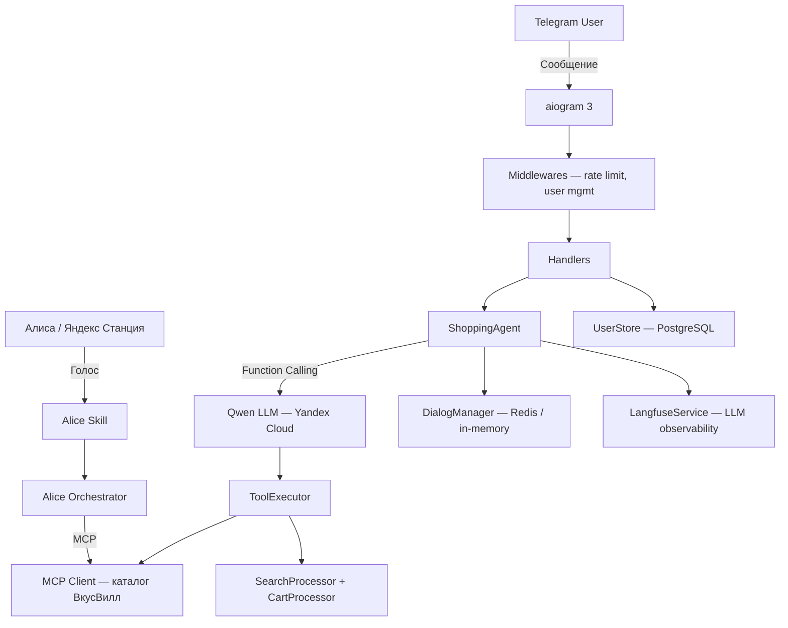

# VkusVill Bot

**Умный ИИ-ассистент для покупок в [ВкусВилл](https://vkusvill.ru)** — напиши, что хочешь купить, и бот соберёт корзину, используя естественный язык.

> **Demo:** [@vkuswill_bot](https://t.me/vkuswill_bot) — попробуй прямо сейчас!

[](https://github.com/mrPDA/vkuswill_bot/actions)
[](https://www.python.org/downloads/)
[](LICENSE)
[](https://github.com/astral-sh/uv)

<!-- TODO: добавить GIF-демо бота в действии -->

---

## Что умеет бот

- **Собирает корзину по запросу** — «Нужно молоко, хлеб и сыр на завтрак» — готовая ссылка на корзину ВкусВилл
- **Рецепты** — «Собери продукты для борща на 4 порции» — автоматический расчёт ингредиентов
- **Предпочтения** — «Я не ем мясо» — бот запомнит и учтёт при следующих поисках
- **КБЖУ и калорийность** — «Низкокалорийные снеки до 100 ккал» — фильтрация по составу
- **Планирование питания** — «План питания на 3 дня» — разнообразное меню с корзиной
- **Контекст диалога** — бот помнит разговор и понимает уточнения

### Пример

```
Пользователь: Нужно молоко, хлеб и масло

Бот: Нашёл и добавил в корзину:
  - Молоко пастеризованное 3,2% 0,93 л — 119 руб
  - Хлеб Бородинский нарезной 350 г — 69 руб
  - Масло сливочное 82,5% 180 г — 189 руб

  Итого: 377 руб
  Корзина готова: https://vkusvill.ru/cart/...
```

---

## Архитектура


```mermaid
graph TD
    A[Telegram User] -->|Сообщение| B[aiogram 3]
    A2[Алиса / Яндекс Станция] -->|Голос| B2[Alice Skill]
    B --> C[Middlewares — rate limit, user mgmt]
    C --> D[Handlers]
    D --> E[ShoppingAgent]
    B2 --> E2[Alice Orchestrator]
    E -->|Function Calling| F[Qwen LLM — Yandex Cloud]
    E2 -->|MCP| H
    F --> G[ToolExecutor]
    G --> H[MCP Client — каталог ВкусВилл]
    G --> I[SearchProcessor + CartProcessor]
    E --> J[DialogManager — Redis / in-memory]
    E --> K[LangfuseService — LLM observability]
    D --> L[UserStore — PostgreSQL]
```

**Qwen** (через Yandex Cloud AI Studio) понимает запрос пользователя и через **function calling** вызывает инструменты: поиск товаров, сборка корзины, сохранение предпочтений. Интеграция с каталогом ВкусВилл работает через **MCP** (Model Context Protocol) — открытый стандарт для подключения LLM к внешним данным.

> Подробнее об архитектурных решениях — в статьях на Хабре (см. ниже).

---

## Технологии

| Компонент | Технология |
|-----------|-----------|
| Telegram-фреймворк | [aiogram 3](https://docs.aiogram.dev/) |
| ИИ-модель | Qwen (OpenAI-compatible) через [Yandex Cloud AI Studio](https://yandex.cloud/ru/services/ai-studio) |
|| Голосовой канал | Алиса (Яндекс Диалоги + Cloud Functions) |
| Интеграция с ВкусВилл | [MCP](https://modelcontextprotocol.io/) (Model Context Protocol) |
| БД (пользователи) | PostgreSQL + asyncpg |
| БД (кеши) | SQLite (aiosqlite) |
| Кэш и сессии | Redis (опционально, fallback на in-memory) |
| LLM Observability | [Langfuse](https://langfuse.com/) (self-hosted) |
| Тестирование | pytest + pytest-asyncio (2200+ тестов) |
| CI/CD | GitHub Actions |
| Деплой | Docker + Kubernetes (Yandex Cloud) |
| Пакетный менеджер | [uv](https://docs.astral.sh/uv/) |

---

## Быстрый старт

### 1. Установка

```bash
git clone https://github.com/mrPDA/vkuswill_bot.git
cd vkuswill_bot
uv sync
```

### 2. Конфигурация

```bash
cp .env.example .env
```

Минимально нужны три переменные:

```bash
# Telegram Bot Token (получить у @BotFather)
BOT_TOKEN=your_telegram_bot_token

# LLM API (Qwen через Yandex Cloud AI Studio)
LLM_API_KEY=your_api_key
LLM_MODEL=your_model_id
```

PostgreSQL и Redis **не обязательны** для локальной разработки — бот автоматически использует in-memory хранилище и SQLite.

### 3. Запуск

```bash
# Через скрипт
./run.sh

# Или напрямую
uv run python -m vkuswill_bot
```

### Docker

```bash
# Всё окружение (бот + PostgreSQL + Redis + Langfuse + Metabase)
docker compose up -d
```

---

## Структура проекта

```
vkuswill_bot/
├── src/vkuswill_bot/           # Исходный код бота
│   ├── __main__.py              # Точка входа
│   ├── config.py                # Конфигурация (pydantic-settings)
│   ├── bot/                     # Handlers, middlewares
│   ├── agents/                  # ShoppingAgent, intent classifier, tool pipeline
│   ├── alice_skill/             # Навык Алисы (Яндекс Диалоги)
│   └── services/                # Бизнес-логика (LLM, MCP, корзина, поиск...)
├── tests/                       # 2200+ тестов (юнит, SAST, AI Safety)
├── migrations/                  # SQL-миграции PostgreSQL
├── infra/                       # Terraform (Yandex Cloud)
├── scripts/                     # Утилиты (deploy, metabase setup)
├── loadtests/                   # Нагрузочное тестирование (Locust)
├── .github/workflows/           # CI/CD pipelines
├── Dockerfile                   # Multi-stage production build
├── docker-compose.yml           # Локальная среда
└── pyproject.toml               # Зависимости (uv)
```

---

## Тестирование

```bash
make test              # Все тесты
make test-cov          # С покрытием
make test-security     # SAST + AI Safety
make lint              # Линтер (ruff)
```

Проект включает 2200+ тестов: юнит-тесты, SAST (секреты, опасные функции), AI Safety (prompt injection, jailbreak), валидация входных данных и тесты навыка Алисы.

---

## Отладка meal-plan и корзины (runbook)

### Stage debug API

Для воспроизведения проблем в одном запросе используйте stage endpoint `POST /debug/run-shopping`.

Условия включения:
- задан `DEBUG_API_KEY`;
- `PROMPT_LABEL` не равен `production`;
- бот запущен в webhook-режиме (`USE_WEBHOOK=true`).

Пример запроса:

```bash
curl -X POST "http://localhost:8080/debug/run-shopping" \
  -H "Content-Type: application/json" \
  -H "X-Debug-Api-Key: ${DEBUG_API_KEY}" \
  -d '{
    "user_id": 12345,
    "text": "План питания на 3 дня для 2 человек",
    "reset_history": true
  }'
```

Что смотреть в ответе:
- `trace_id` — корреляция с Langfuse;
- `cart_snapshot` — финальное состояние корзины;
- `diagnostics.execution_path` — какой путь выполнен (`meal_plan_executor` или стандартный turn);
- `diagnostics.meal_plan_ingredient_collection` — MCP/fallback статистика ингредиентов;
- `diagnostics.meal_plan_recipe_search` — статистика day-by-day поиска;
- `diagnostics.meal_plan_cart_create` — информация о создании корзины/групп корзин.

### Частые симптомы и причины

| Симптом | Проверка | Типичная причина |
|---|---|---|
| В ответе несколько ссылок на корзину | `diagnostics.meal_plan_cart_create.groups_count` | Лимит MCP `vkusvill_cart_link_create`: максимум 30 товаров на одну корзину, поэтому создаются grouped carts |
| Для части блюд нет ингредиентов | `diagnostics.meal_plan_ingredient_collection` (`fallback_attempted_dishes`, `empty_dishes`) | Деградация/таймаут `recipe_ingredients`, переход на batch fallback |
| Много `not_found` по ингредиентам | `diagnostics.meal_plan_recipe_search.final_not_found_count` | Слишком длинные/контекстные `search_query` (например, "рис для суши" вместо "рис") |

### Ограничения search_query для recipe fallback

При изменении промптов recipe extraction и batch fallback соблюдайте базовые правила:
- короткий запрос: 1-2 слова;
- без контекста блюда (не "масло для жарки");
- без лишних прилагательных (не "свежий", "молотый");
- без уточнения сорта по умолчанию ("рис", а не "рис басмати");
- исключения для диетических требований допустимы (например, "безлактозное молоко", "тофу").

---

## Команды бота

| Команда | Описание |
|---------|----------|
| `/start` | Приветствие и инструкция |
| `/help` | Справка по возможностям |
| `/reset` | Сбросить историю диалога |
| `/survey` | Пройти опрос и получить бонусные корзины |
| `/invite` | Реферальная ссылка для приглашения друзей |
| `/link_voice` | Привязать Алису для голосовых заказов |
| `/unlink_voice` | Отвязать Алису |
| `/privacy` | Политика конфиденциальности |

---

## Серия статей на Хабре

Подробное описание архитектуры, решений и граблей — в серии статей:

| # | Статья | Тема |
|---|--------|------|
| 1 | *Скоро* | Демо и обзор — как бот собирает корзину по одному сообщению |
| 2 | *Скоро* | MCP + GigaChat — как подключить LLM к API ВкусВилл |
| 3 | *Скоро* | 11 граблей function calling на GigaChat |
| 4 | *Скоро* | Тестирование ИИ-бота: SAST, AI Safety, 98% покрытие |
| 5 | *Скоро* | Юнит-экономика Telegram-бота с ИИ |

> Ссылки появятся здесь по мере публикации. Подпишитесь на профиль автора на Хабре, чтобы не пропустить!

---

## Вклад в проект

Мы приветствуем контрибьюции! Подробное руководство — в [CONTRIBUTING.md](CONTRIBUTING.md).

```bash
# Быстрый старт для контрибьюторов
git checkout -b feature/amazing-feature
git config core.hooksPath .githooks
# ... внесите изменения и напишите тесты ...
git commit -m "feat: add amazing feature"
make test && make lint
git push origin feature/amazing-feature
# Создайте Pull Request
```

Проект использует [Conventional Commits](https://www.conventionalcommits.org/) и автоматическую валидацию через git hooks.

---

## Агентный workflow (для разработчиков)

Проект разрабатывается командой ИИ-агентов («экипаж Испаньолы»). Правила работы, реестр агентов и workflows описаны в [AGENTS.md](AGENTS.md).

### MCP-сервисы для агентов

| Сервис | Роль | MCP alias |
|--------|------|-----------|
| **notesforllm** | Persistent memory — checkpoints, decisions, handoffs между сессиями | `user-notesforllm` |
| **Git/MCP Workbench** | Git-aware контекст — status, diff, commits, PR prep. Доступен только после локальной настройки `.cursor/mcp.json`; шаблон в репозитории — `workbench-mcp.json.example`. | `git_mcp_workbench` |

### Настройка

1. Скопировать `.env.example` → `.env` и заполнить секцию `Agent MCP Services`
2. Подключить MCP-серверы в настройках IDE (Cursor / VS Code)
   Workbench не считается подключенным по умолчанию: нужен локальный `.cursor/mcp.json`, собранный по `workbench-mcp.json.example`
3. Проверить конфигурацию: `bash scripts/check-agent-config.sh`

Подробнее — в [docs/integration-setup.md](docs/integration-setup.md).

### Базовый workflow агента

```
Старт сессии → notes_resume_context() → git status → работа
     ↓                                                  ↓
  читаю prior decisions                    checkpoint после milestone
     ↓                                                  ↓
  планирую работу                          decision при архитектурном выборе
                                                        ↓
                                    Конец сессии → handoff (если не закончено)
```

---

## Roadmap

- [x] Голосовой канал — навык Алисы для заказа через Яндекс Станцию
- [x] Freemium-модель — trial, survey, реферальная система, feedback-бонусы
- [ ] Рекомендации на основе истории покупок
- [ ] Поддержка других магазинов через MCP
- [ ] Telegram Mini App для управления корзиной

---

## Лицензия

[Apache 2.0](LICENSE) — свободное использование, модификация и распространение с сохранением авторства и патентной защитой.

---

## Контакты

- **Бот** — [@vkus_eda_voda_bot](https://t.me/vkus_eda_voda_bot)
- **Issues** — [GitHub Issues](https://github.com/mrPDA/vkuswill_bot/issues)
- **Discussions** — [GitHub Discussions](https://github.com/mrPDA/vkuswill_bot/discussions)

Нашли уязвимость? **Не создавайте публичный issue** — напишите на [d.pukinov@yandex.ru](mailto:d.pukinov@yandex.ru).
