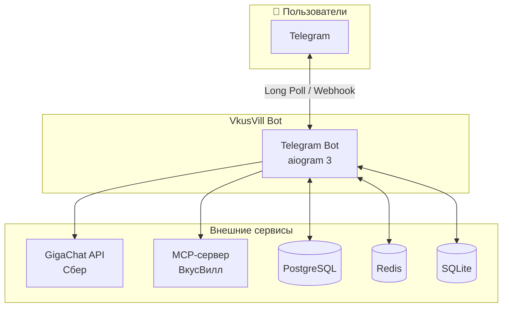
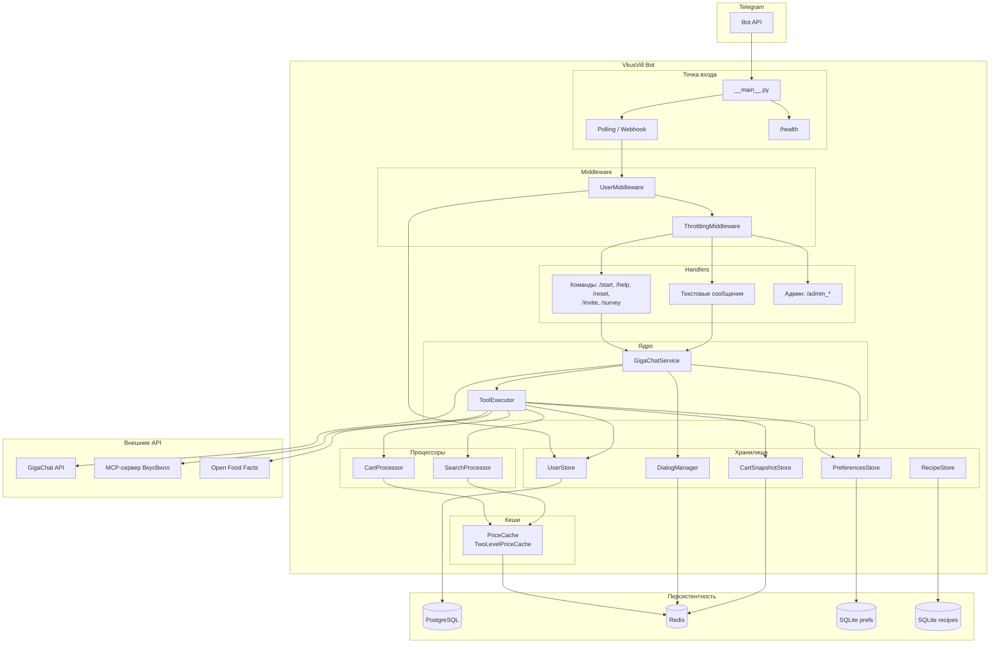
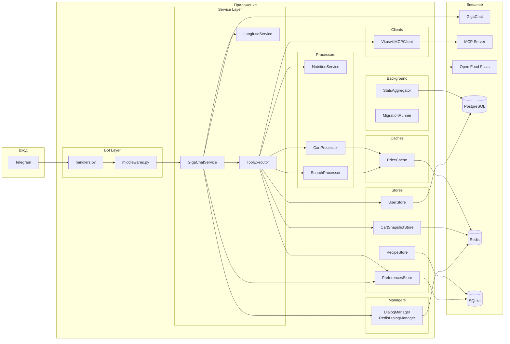
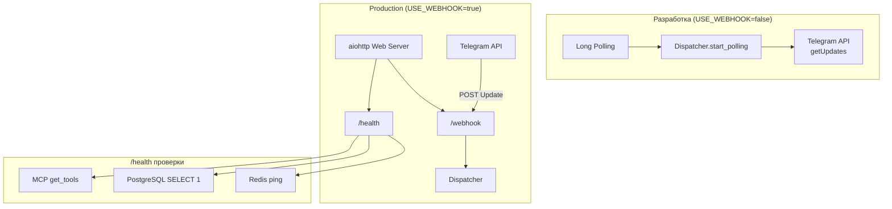
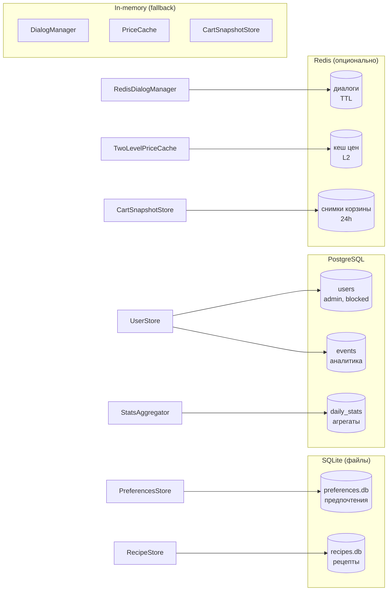
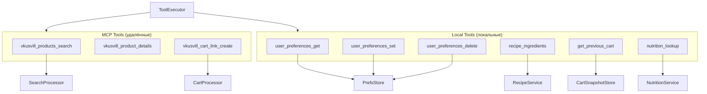

# Архитектура VkusVill Bot

Mermaid-диаграммы архитектуры проекта.

---

## Общая схема (C4 Context)

---

## Поток данных (уровень контейнеров)

---

## Компоненты и зависимости (детальная схема)

---

## Цикл обработки сообщения (Function Calling)

---

## Режимы работы (Polling vs Webhook)

---

## Хранилища данных

---

## Инструменты (Tools) ToolExecutor

---

## Meal-plan pipeline (актуальное поведение)

Подсистема meal-plan обрабатывается отдельным executor, а не общим tool-loop.
Это снижает нестабильность в длинных сценариях и позволяет жёстко валидировать
контракт плана до поиска товаров и сборки корзины.

### Ключевые codepaths

| Этап | Codepath | Что делает |
|------|----------|------------|
| Разбор запроса | `src/vkuswill_bot/agents/meal_plan_request_extractor.py` | LLM-first извлечение полей запроса (JSON), затем детерминированная сборка `MealPlanRequest` |
| Нормализация доменной модели | `src/vkuswill_bot/agents/meal_plan_types.py` | Нормализует `days`, группы, ограничения, `requested_meal_types`, вычисляет `min_dishes/max_dishes` |
| Генерация плана | `src/vkuswill_bot/agents/meal_plan_generator.py` | Просит LLM вернуть JSON `schema_version=1`, валидирует схему и делает один retry при ошибке |
| Оркестрация этапов | `src/vkuswill_bot/agents/meal_plan_executor.py` | Parse → Generate → Ingredients → Search → Cart + fail-soft/fallback и таймаут-политика |

### Последовательность обработки

1. `run_meal_plan_turn(...)` запускает специализированный pipeline.
2. `parse_meal_plan_request_with_llm(...)` пытается извлечь структуру из LLM-ответа:
   - `temperature=0.0`, `tool_choice=none`;
   - если JSON невалидный, делает один retry;
   - при повторном фейле переключается на детерминированный парсер.
3. `parse_meal_plan_request(...)` применяет guardrails:
   - `days` в диапазоне `1..14`, поддерживаются формулировки вроде `на два дня`;
   - число дней не интерпретируется как число людей;
   - `people_total` вычисляется детерминированно по явным маркерам людей.
4. `generate_meal_plan(...)` валидирует payload:
   - строго `schema_version=1`;
   - уникальные названия блюд, валидные `day/meal_type/servings_total/audience_groups`;
   - покрытие слотов по дням для явных `requested_meal_types`.
5. После генерации executor собирает ингредиенты, применяет phase2 safety,
   ищет товары по дням и формирует корзину(ы).

### Важные инварианты и ограничения

- Для коротких явных запросов слотов (например, `обеды на два дня`) при одной общей
  группе используется **точное** число блюд:
  `min_dishes == max_dishes == days * len(requested_meal_types)`.
- Лишние "заполнители" в том же слоте (дополнительный lunch в один день) отклоняются
  валидацией payload.
- Для `requested_meal_types=["snack"]` допускаются `snack_1..snack_3`, но наличие
  хотя бы одного snack-слота в каждый день остаётся обязательным.
- Если LLM в extraction-шаге "додумает" `people_total`, итоговое значение всё равно
  берётся из детерминированного парсинга текста.

### Быстрые примеры нормализации

| Вход пользователя | Нормализованный результат |
|-------------------|---------------------------|
| `собери мне обеды для здорового питания на два дня` | `days=2`, `requested_meal_types=["lunch"]`, `people_total=1`, `min_dishes=max_dishes=2` |
| `меню на 3 дня для 2 человек` | `days=3`, `people_total=2`, `requested_meal_types=[]` (далее по умолчанию 3 слота/день) |

---

## Легенда

| Компонент | Назначение |
|-----------|------------|
| **GigaChatService** | Оркестрация LLM, function calling, история диалогов |
| **ToolExecutor** | Маршрутизация MCP vs local tools, обработка ошибок |
| **SearchProcessor** | Поиск товаров, кеш цен, постпроцессинг результатов |
| **CartProcessor** | Сборка корзины, верификация, расчёт стоимости |
| **DialogManager** | Хранение истории диалога (in-memory или Redis) |
| **PreferencesStore** | Предпочтения пользователя (SQLite) |
| **UserStore** | Пользователи, админы, блокировки, рефералы (PostgreSQL) |
| **VkusvillMCPClient** | JSON-RPC клиент к MCP-серверу ВкусВилл |
| **PriceCache** | Кеш цен (in-memory или L1+L2 с Redis) |
