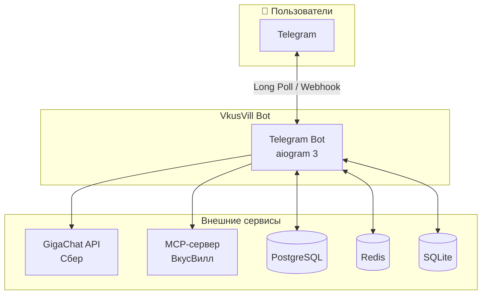
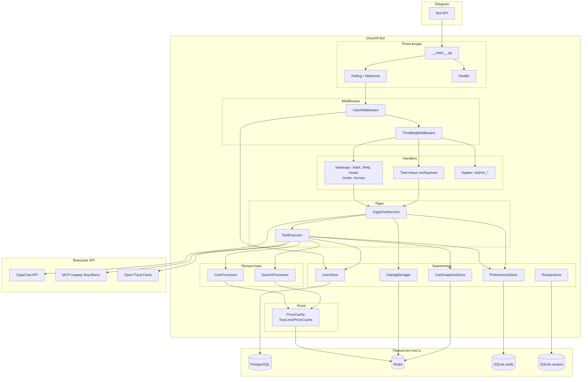
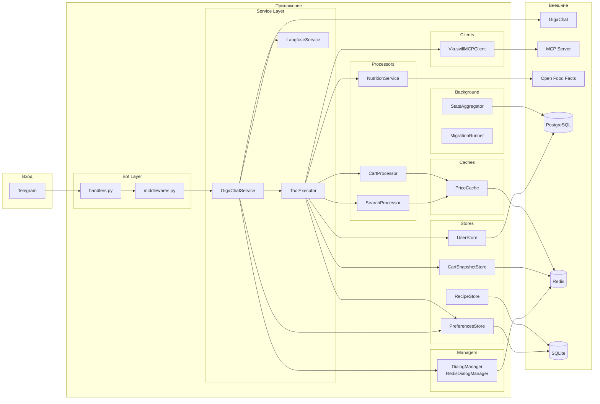
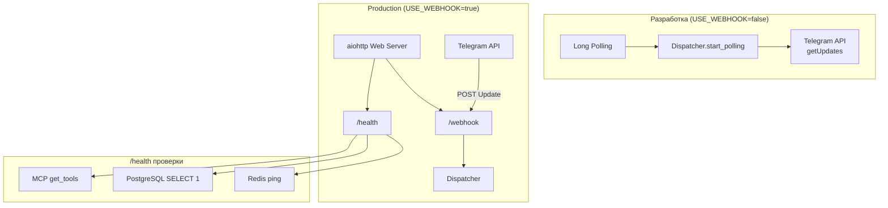
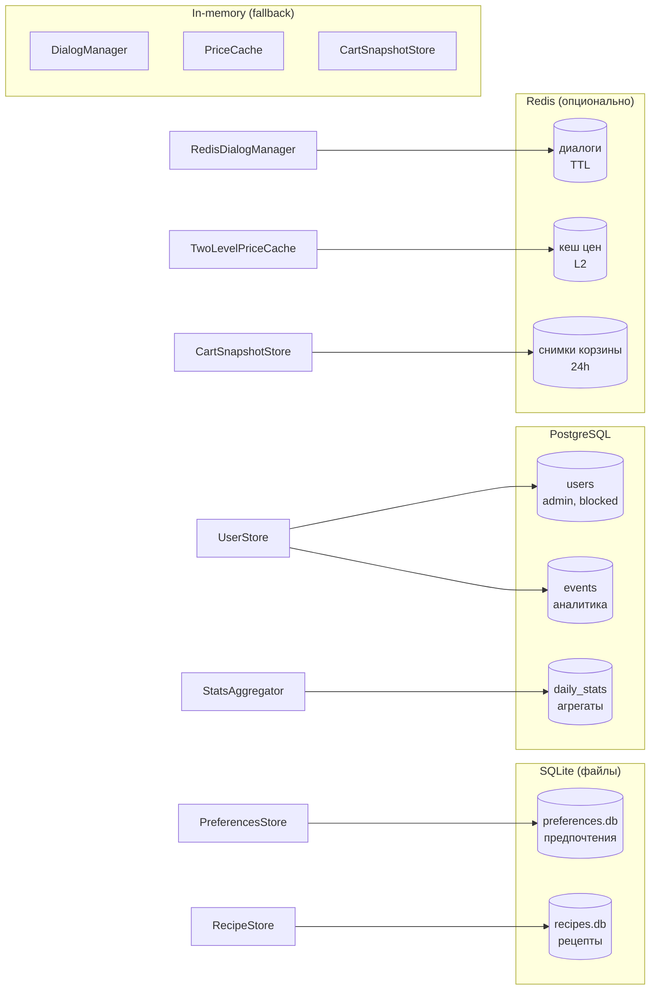
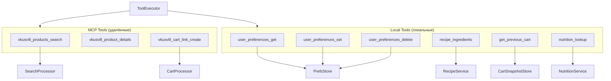

# Архитектура VkusVill Bot

Mermaid-диаграммы архитектуры проекта.

---

## Общая схема (C4 Context)

---

## Поток данных (уровень контейнеров)

---

## Компоненты и зависимости (детальная схема)

---

## Цикл обработки сообщения (Function Calling)

---

## Режимы работы (Polling vs Webhook)

---

## Хранилища данных

---

## Инструменты (Tools) ToolExecutor

---

## Актуальные инварианты (март 2026)

### 1) Meal-plan: LLM-first extraction + deterministic fallback

`meal_plan`-ветка использует отдельный executor (`run_meal_plan_turn`) и сначала пытается извлечь структуру запроса через LLM (`parse_meal_plan_request_with_llm`), а затем:

- валидирует и нормализует поля (`days`, `people_total`, `diet`, `requested_meal_types`, `allergens_excluded`);
- при невалидном JSON или ошибке LLM откатывается на детерминированный парсер без падения user-flow;
- пишет diagnostics/trace-метаданные о source (`llm` vs `deterministic_*_fallback`) для наблюдаемости.

Ключевые codepath:

- `src/vkuswill_bot/agents/meal_plan_executor.py`
- `src/vkuswill_bot/agents/meal_plan_request_extractor.py`
- `src/vkuswill_bot/agents/shopping_turn_executor.py`

Ограничения:

- запуск meal-plan executor gated через rollout/shadow-mode;
- fallback к стандартному turn-пути встроен и ожидаем как штатный сценарий, а не как crash-path.

### 2) Cart tool args: единая нормализация перед MCP

Для `vkusvill_cart_link_create` аргументы приводятся к единому виду до вызова MCP:

- автоподстановка `q=1`, если количество не задано;
- нормализация строковых `q` (например, `"1,5"` -> `1.5`);
- merge дублей по `xml_id` с суммированием количества;
- последующая корректировка единиц (`fix_unit_quantities`) в preprocessor pipeline.

Ключевые codepath:

- `src/vkuswill_bot/services/tool_input_normalizers.py` (`fix_cart_args`)
- `src/vkuswill_bot/services/tool_executor_pipeline.py` (`ToolArgsPreprocessor.preprocess`)
- `src/vkuswill_bot/services/cart_processor.py`

Практический эффект: одинаковые cart-аргументы независимо от того, кто вызвал корзину (агент, recipe flow, recovery path), и меньше регрессий на смешанных форматах количества.

### 3) Response contracts: единый набор для stage и live runtime

Сценарии `TC-*` вынесены в shared-модуль и переиспользуются двумя раннерами:

- stage pytest (`tests/test_stage_response_contracts.py`) проверяет debug API + Langfuse trace provenance;
- live runner (`scripts/run_live_response_contracts.py`) гоняет тот же набор на текущем локальном runtime.

Ключевые codepath:

- `src/vkuswill_bot/testing/response_contract_cases.py`
- `tests/test_stage_response_contracts.py`
- `scripts/run_live_response_contracts.py`
- `src/vkuswill_bot/bot/telegram_delivery.py`

Runbook: `docs/stage-response-contracts.md`.

---

## Легенда

| Компонент | Назначение |
|-----------|------------|
| **GigaChatService** | Оркестрация LLM, function calling, история диалогов |
| **ToolExecutor** | Маршрутизация MCP vs local tools, обработка ошибок |
| **SearchProcessor** | Поиск товаров, кеш цен, постпроцессинг результатов |
| **CartProcessor** | Сборка корзины, верификация, расчёт стоимости |
| **DialogManager** | Хранение истории диалога (in-memory или Redis) |
| **PreferencesStore** | Предпочтения пользователя (SQLite) |
| **UserStore** | Пользователи, админы, блокировки, рефералы (PostgreSQL) |
| **VkusvillMCPClient** | JSON-RPC клиент к MCP-серверу ВкусВилл |
| **PriceCache** | Кеш цен (in-memory или L1+L2 с Redis) |
