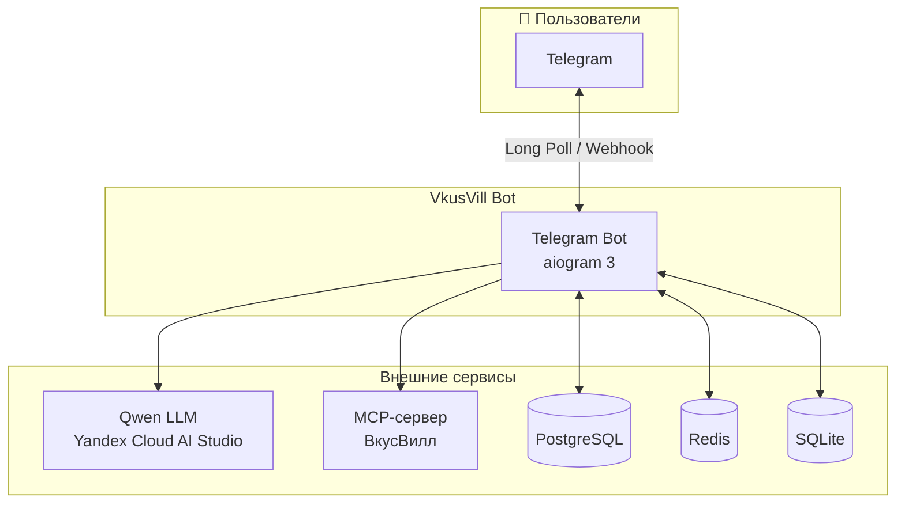
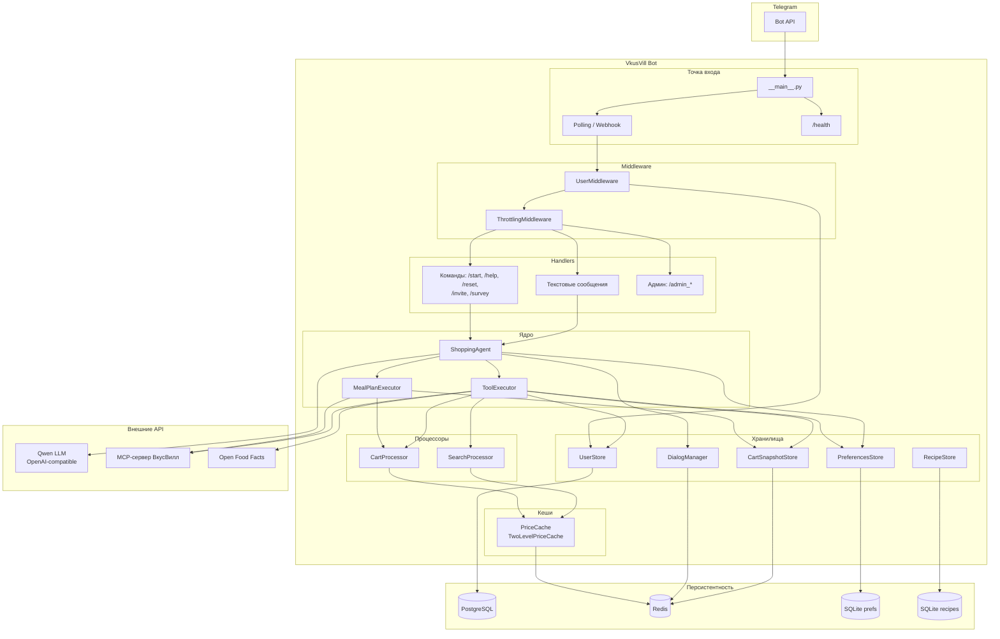
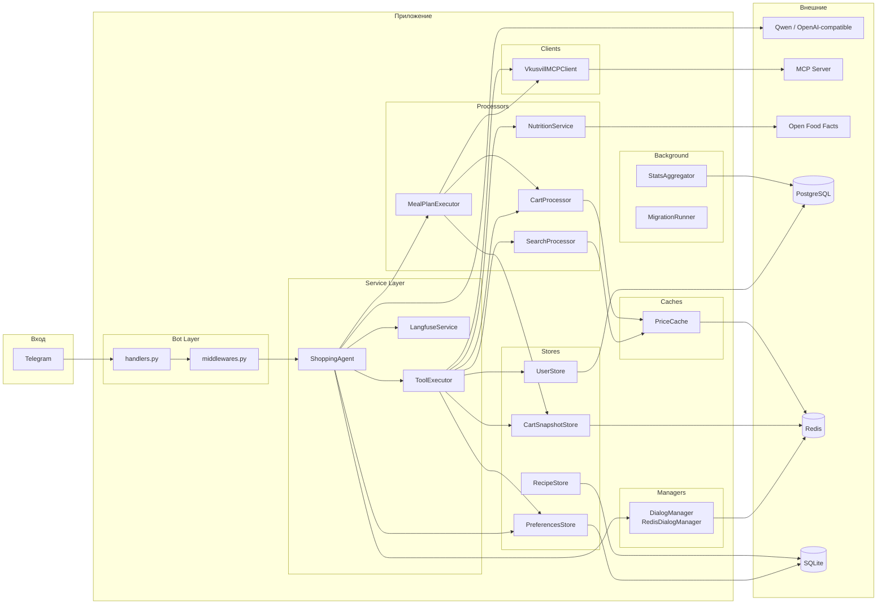
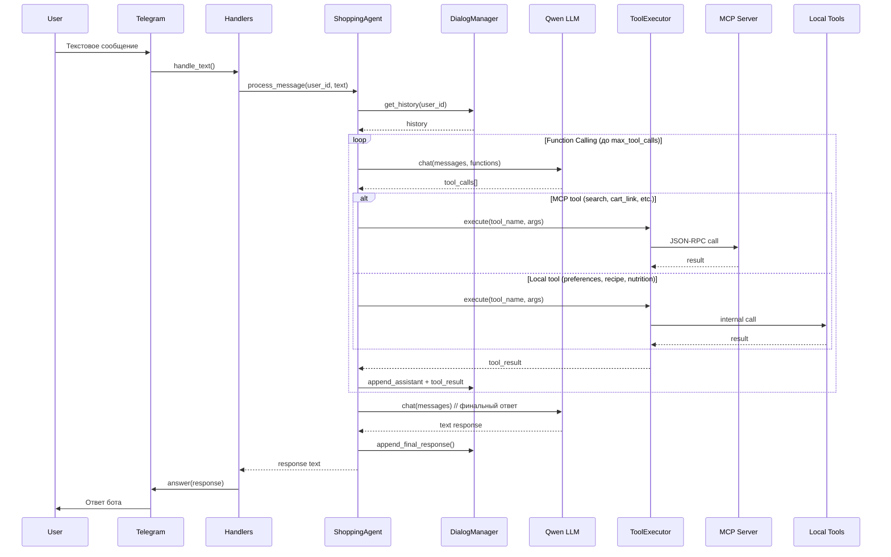
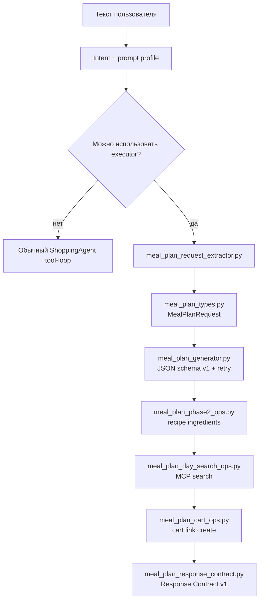
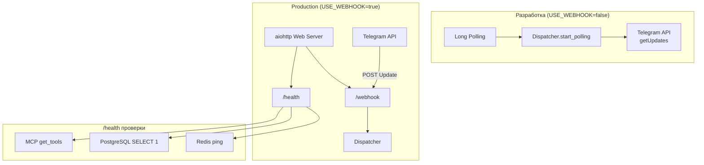
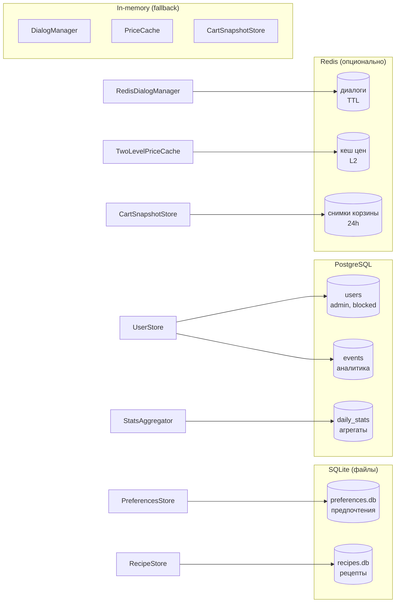
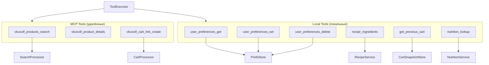

# Архитектура VkusVill Bot

Mermaid-диаграммы архитектуры проекта.

---

## Общая схема (C4 Context)

---

## Поток данных (уровень контейнеров)

---

## Компоненты и зависимости (детальная схема)

---

## Цикл обработки сообщения (Function Calling)

---

## Meal-plan executor

Запросы планирования питания проходят через тот же `ShoppingAgent`, но при
`diagnostics.prompt_profile == "meal_plan"` могут уйти в выделенный executor
вместо общего tool-loop. Это сделано, чтобы меню, ингредиенты и корзина
строились по детерминированному контракту, а не зависели от произвольного
финального ответа LLM.

Ключевые ограничения:

- `ShoppingAgent` поддерживает только `LLM_PROVIDER=qwen_openai` и
  `LLM_ROUTING_STRATEGY=single_provider`; фабрика `create_chat_engine()` падает
  при другой конфигурации.
- Gate executor-а находится в `agents/shopping_turn_executor.py`: нужен
  `prompt_profile="meal_plan"`, включенный `MEAL_PLAN_EXECUTOR_ENABLED`, не
  включенный shadow mode и попадание пользователя в rollout bucket.
- KPI-gate rollout-а живет в `services/meal_plan_rollout_policy.py`. В
  production unvalidated bypass запрещен; в non-prod он требует reason, actor,
  валидный `expires_at` и TTL не больше
  `MEAL_PLAN_UNVALIDATED_ROLLOUT_MAX_TTL_SECONDS`.
- `meal_plan_types.py` парсит дни, аудитории, аллергены, диеты, кухни и явные
  приёмы пищи. Для запроса вроде "обеды на два дня" диапазон блюд становится
  точным: `days * requested_meal_types`.
- `meal_plan_generator.py` принимает только `schema_version=1`, проверяет
  диапазон блюд, дни, `meal_type`, `servings_total`, `audience_groups`, покрытие
  дней/слотов и hard-constraints. Разрешен один retry после repair JSON
  (markdown fences, trailing comma, JSON внутри free-form текста).
- Runtime deadlines описаны в `agents/meal_plan_runtime_policy.py`: планы на 5+
  дней получают расширенный turn/phase2 budget, отдельные MCP-вызовы ограничены
  timeout-ами и одним retry.

---

## Нормализация корзины

Аргументы `vkusvill_cart_link_create` проходят две ступени нормализации:

1. `services/tool_input_normalizers.py::fix_cart_args` — shared слой для
   `ToolExecutor` и `CartProcessor`: добавляет `q=1`, приводит строковые `q`
   (`"1,5"` -> `1.5`) к float и суммирует дубли по `xml_id`.
2. `services/cart_processor.py::fix_unit_quantities` — асинхронная коррекция по
   `PriceCache`: округляет штучные единицы вверх, ограничивает q, пересчитывает
   подозрительные граммы/мл в количество упаковок и отдельно нормализует яйца
   до одной упаковки.

Если меняется поведение количества или объединения товаров, править нужно
shared normalizer и покрывать его тестами на уровне tool preprocessing; если
нужны правила по unit/весу/ценам, править `CartProcessor` и проверять сценарии с
`PriceCache`.

---

## Режимы работы (Polling vs Webhook)

---

## Хранилища данных

---

## Инструменты (Tools) ToolExecutor

---

## Легенда

| Компонент | Назначение |
|-----------|------------|
| **ShoppingAgent** | Оркестрация Qwen/OpenAI-compatible runtime, function calling, история диалогов |
| **ToolExecutor** | Маршрутизация MCP vs local tools, обработка ошибок |
| **MealPlanExecutor** | Выделенный pipeline планирования питания: запрос, меню, ингредиенты, корзина, контракт ответа |
| **SearchProcessor** | Поиск товаров, кеш цен, постпроцессинг результатов |
| **CartProcessor** | Нормализация количества, сборка корзины, верификация, расчёт стоимости |
| **DialogManager** | Хранение истории диалога (in-memory или Redis) |
| **PreferencesStore** | Предпочтения пользователя (SQLite) |
| **UserStore** | Пользователи, админы, блокировки, рефералы (PostgreSQL) |
| **VkusvillMCPClient** | JSON-RPC клиент к MCP-серверу ВкусВилл |
| **PriceCache** | Кеш цен (in-memory или L1+L2 с Redis) |
