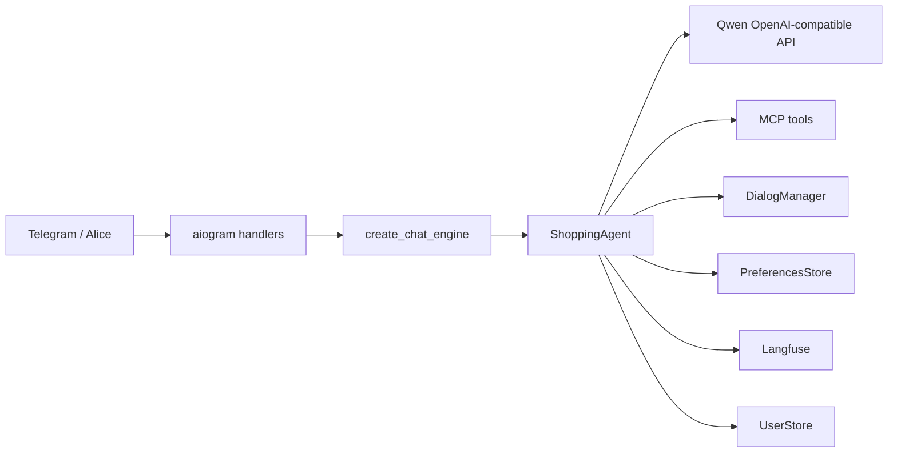

# Архитектура VkusVill Bot

Документ отражает **текущий runtime** на базе `ShoppingAgent` и `Qwen OpenAI-compatible`.

## 1) Актуальный runtime-контур



Кодовые точки:

- `src/vkuswill_bot/services/chat_engine_factory.py` - фабрика runtime (`ShoppingAgent only`).
- `src/vkuswill_bot/agents/shopping_agent.py` - основной chat engine.
- `src/vkuswill_bot/agents/shopping_turn_executor.py` - цикл одного turn-а и роутинг executor-веток.
- `src/vkuswill_bot/agents/meal_plan_executor.py` - специализированный meal-plan pipeline.

## 2) Публичный интерфейс chat engine

Контракт описан в `src/vkuswill_bot/services/chat_engine.py` (`ChatEngineProtocol`):

- `process_message(user_id, text, on_progress=None) -> str`
- `reset_conversation(user_id) -> None`
- `get_last_cart_snapshot(user_id) -> dict | None`
- `get_last_trace_id(user_id) -> str | None`
- `close() -> None`

Это API используют Telegram handlers и voice-контур, поэтому изменения сигнатур считаются breaking.

## 3) Маршрут обработки одного сообщения

Порядок ветвления в `run_locked_turn(...)`:

1. Построение `TurnState` + diagnostics + trace.
2. Проверка, можно ли идти в `meal_plan_executor` (profile, rollout, shadow mode, feature flags).
3. Если не meal-plan: попытка `multi_course_executor`.
4. Если не multi-course: быстрые ветки:
   - `status_cart_shortcircuit`
   - `explicit_cart_fast_path` (явный запрос на корзину)
5. Иначе - стандартный tool-loop (`_max_tool_calls`) с MCP/local tools.

Ключевое ограничение из `create_chat_engine(...)`:

- поддерживается только `LLM_PROVIDER=qwen_openai`
- `LLM_ROUTING_STRATEGY=single_provider`

## 4) Meal-plan executor: что важно знать

### 4.1 Разбор запроса (LLM-first + fallback)

`parse_meal_plan_request_with_llm(...)`:

- сначала просит LLM вернуть JSON структуры запроса;
- при невалидном JSON делает один retry с жёсткой инструкцией;
- при ошибке откатывается в детерминированный парсер `parse_meal_plan_request(...)`.

Практический эффект: сбой парсера не обрывает turn, а переводит в fallback-путь.

### 4.2 Нормализация people/days и ограничения

Из `meal_plan_people_parser.py` и `meal_plan_types.py`:

- `days`: `1..14`, word-based формы (`"два дня"`, `"рабочая неделя"`) поддержаны.
- `people_total`: `1..20`.
- Без явного указания людей система **не выводит "2 человека из 2 дней"**; базово остаётся `default=1`, кроме сегментированного паттерна `"один..., другой..."`.

### 4.3 Валидация структуры плана

`meal_plan_generator.py` валидирует:

- `schema_version == 1`
- диапазон количества блюд через `dish_count_range_for_request(...)`
- уникальность названий блюд
- валидные `day`, `meal_type`, `servings_total`, `audience_groups`
- покрытие дней/слотов (включая explicit meal slots)

Важно для short meal slots:

- если пользователь явно запросил слоты (`requested_meal_types`) и группа одна, диапазон блюд фиксируется в точное число слотов (`days * slots`), без лишних "филлеров".

### 4.4 Phase 2

`run_meal_plan_turn(...)` выполняет:

1. сбор ингредиентов;
2. phase2 safety policy;
3. поиск продуктов по дням;
4. сбор grouped carts;
5. deterministic rendering ответа.

На каждом этапе есть дедлайны и fail-soft fallback, чтобы turn завершался предсказуемо.

## 5) Нормализация входа для корзины

`src/vkuswill_bot/services/tool_input_normalizers.py`:

- нормализует разговорные числительные и смешанный язык/translit для grocery-запросов;
- очищает поисковую строку от количеств и единиц;
- в `fix_cart_args(...)`:
  - подставляет `q=1`, если количество не передано;
  - объединяет дубли по `xml_id`;
  - приводит `q` к `float`, включая строки с запятой (`"1,5" -> 1.5`).

Следствие для интеграций: дробные количества в корзине допустимы и ожидаемы.

## 6) Диагностика и observability

- Turn-диагностика пишется в `_last_turn_diagnostics` (например, execution path, rollout gate, phase stats).
- Trace/generation-спаны отправляются в Langfuse (`shopping_turn_executor.py`, `meal_plan_executor.py`).
- Для stage/live контрактов используется общий набор сценариев:
  - `src/vkuswill_bot/testing/response_contract_cases.py`.

## 7) Что проверять при изменениях

Минимум после правок в routing/meal-plan/cart:

```bash
uv run pytest tests/test_meal_plan_executor.py tests/test_meal_plan_generator.py
uv run pytest tests/test_shopping_turn_executor.py tests/test_cart_processor.py
uv run pytest tests/test_stage_response_contracts.py -m stage -rs
```
