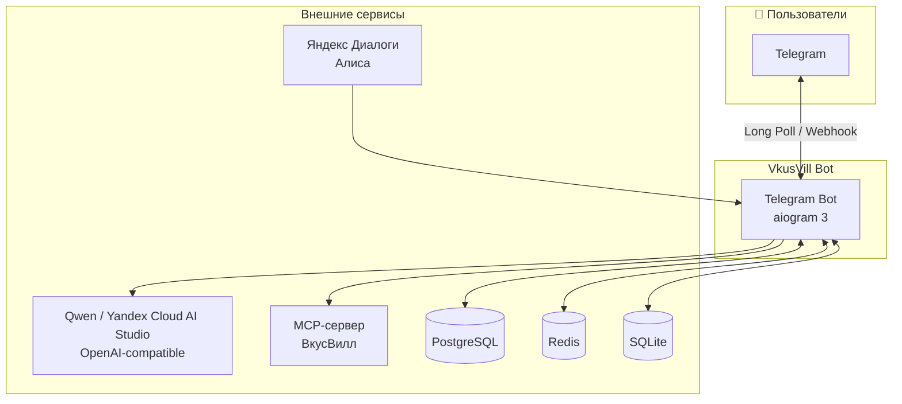
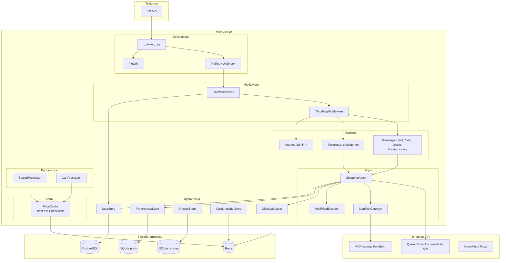
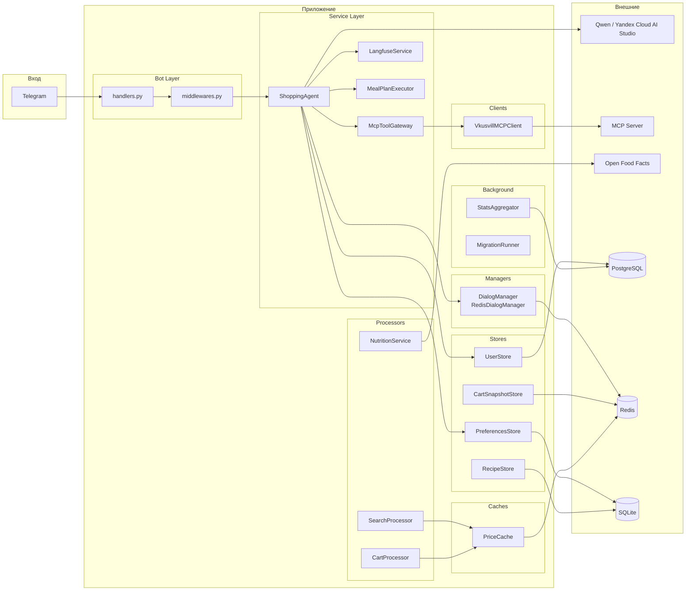
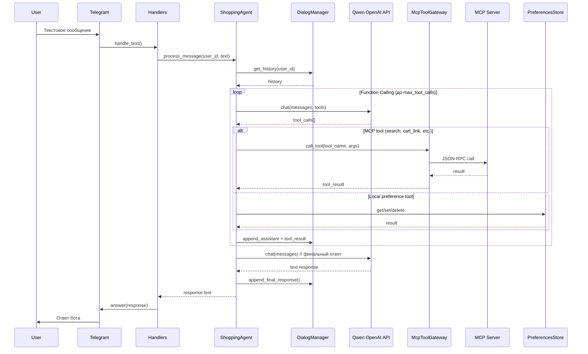
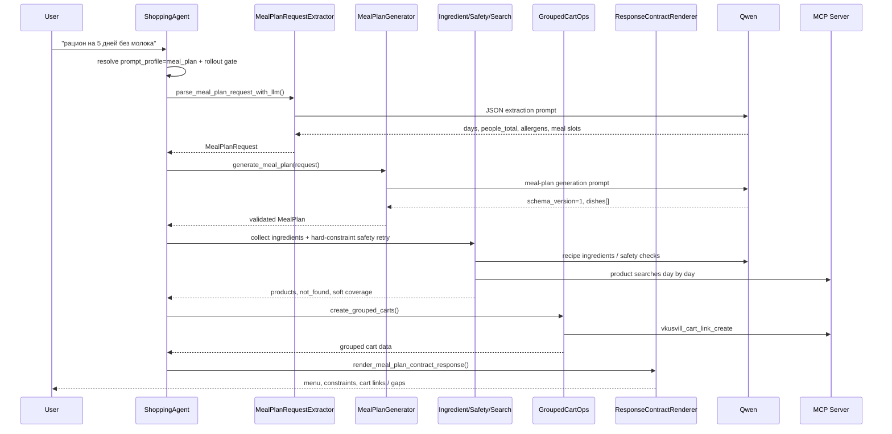
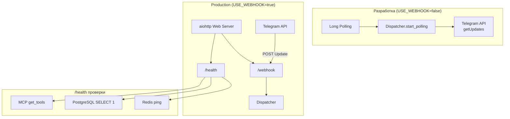
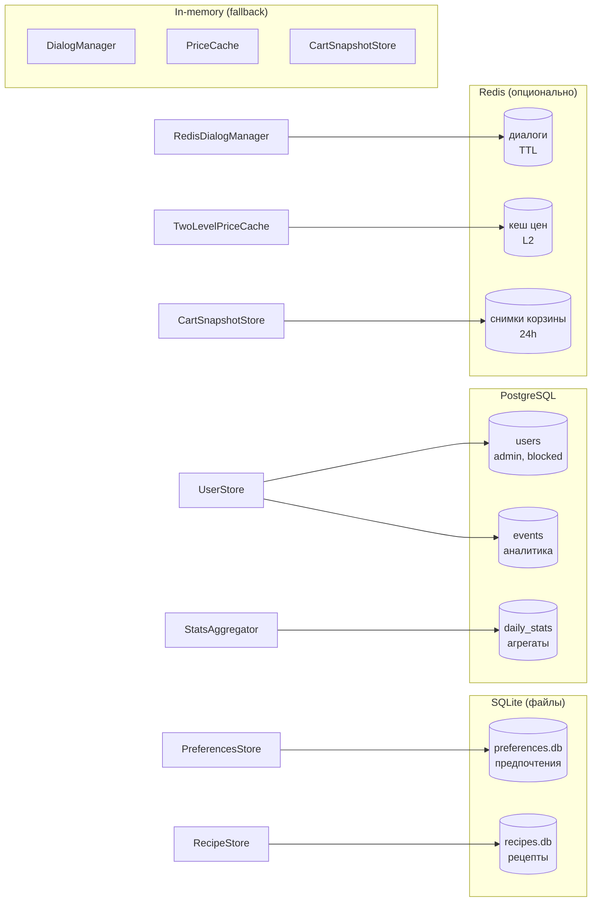
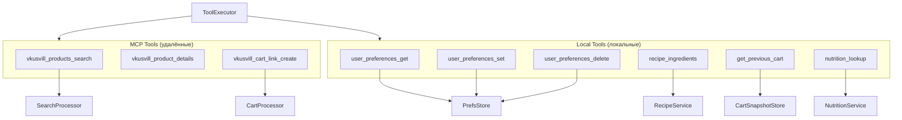

# Архитектура VkusVill Bot

Mermaid-диаграммы архитектуры проекта.

---

## Общая схема (C4 Context)

---

## Поток данных (уровень контейнеров)

---

## Компоненты и зависимости (детальная схема)

---

## Цикл обработки сообщения (Function Calling)

---

## Meal-plan поток

Meal-plan не проходит обычный цикл свободных tool calls от начала до конца.
`ShoppingAgent` сначала определяет `prompt_profile` (`cart`, `recipe`,
`meal_plan`, `status`), а затем для `meal_plan` может запустить выделенный
`run_meal_plan_turn()` из `src/vkuswill_bot/agents/meal_plan_executor.py`.

Ключевые ограничения:

- `LLM_PROVIDER` поддерживается только как `qwen_openai`, `LLM_ROUTING_STRATEGY`
  только `single_provider`; это проверяет `create_chat_engine()`.
- LLM-first extraction ограничена доменной моделью `MealPlanRequest`: `days`
  1..14, `people_total` 1..20, допустимые meal slots
  `breakfast/lunch/dinner/snack`.
- Явные meal-slot запросы для одной группы (`обеды на два дня`) дают точное
  число блюд: `days * len(requested_meal_types)`, без дополнительных filler-блюд.
- `hard_constraints` (аллергены, исключения, детские ограничения) проверяются
  после сбора ингредиентов; при нарушении Phase 2 может перегенерировать план или
  fail-soft в стандартный turn.
- Результат рендерится детерминированным response contract v1, чтобы stage/live
  проверки могли валидировать профиль, размер ответа и запрещённые продукты.

Операционные флаги находятся в `Config`: `MEAL_PLAN_INTENT_ROUTING_ENABLED`,
`MEAL_PLAN_EXECUTOR_ENABLED`, `MEAL_PLAN_SHADOW_MODE_ENABLED`,
`MEAL_PLAN_ROLLOUT_PERCENT`, `MEAL_PLAN_ROLLOUT_KPI_GATES_ENABLED` и
`MEAL_PLAN_ALLOW_UNVALIDATED_ROLLOUT`. При включённых KPI gates rollout может
использовать `MealPlanRolloutController` поверх PostgreSQL events.

---

## Режимы работы (Polling vs Webhook)

---

## Хранилища данных

---

## Инструменты и ToolExecutor

Основной Telegram runtime использует `ShoppingAgent._call_mcp_tool()` и
`McpToolGateway`: gateway вызывает удалённый MCP-сервер, кеширует безопасные
tool results в рамках turn и включает локальные fallback для `recipe_ingredients`
и `recipe_search`, если таких MCP tools нет.

`ToolExecutor` остаётся локальным pipeline для встроенного
`src/vkuswill_bot/mcp_server/server.py`: он нужен, когда этот репозиторий сам
поднимает MCP-compatible сервер и маршрутизирует tools в локальные processors.

---

## Легенда

| Компонент | Назначение |
|-----------|------------|
| **ShoppingAgent** | Основной chat engine: OpenAI-compatible Qwen, prompt profiles, tool loop, история диалогов |
| **McpToolGateway** | Выполнение MCP tool calls внутри `ShoppingAgent` с таймаутами, retry и компактированием результатов |
| **MealPlanExecutor** | Выделенный pipeline для meal-plan: extraction, generation, ingredients, safety, grouped carts, deterministic render |
| **ToolExecutor** | Pipeline встроенного MCP-сервера: pre/postprocess args/results, local tools, Cart/Search processors |
| **SearchProcessor** | Поиск товаров, кеш цен, постпроцессинг результатов |
| **CartProcessor** | Сборка корзины, верификация, расчёт стоимости |
| **DialogManager** | Хранение истории диалога (in-memory или Redis) |
| **PreferencesStore** | Предпочтения пользователя (SQLite) |
| **UserStore** | Пользователи, админы, блокировки, рефералы (PostgreSQL) |
| **VkusvillMCPClient** | JSON-RPC клиент к MCP-серверу ВкусВилл |
| **PriceCache** | Кеш цен (in-memory или L1+L2 с Redis) |
