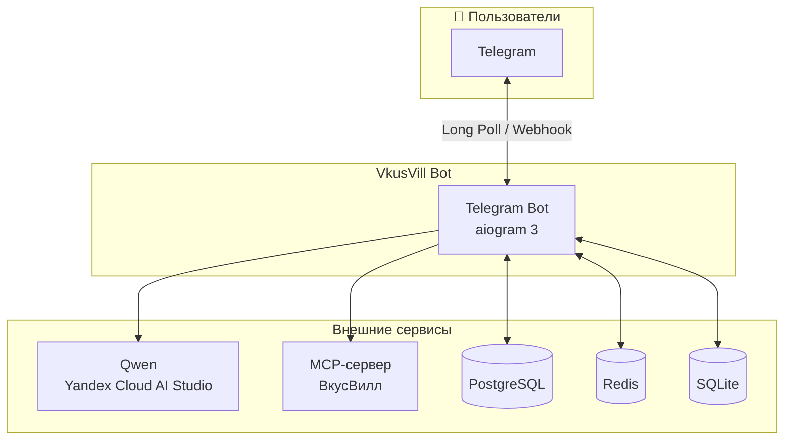
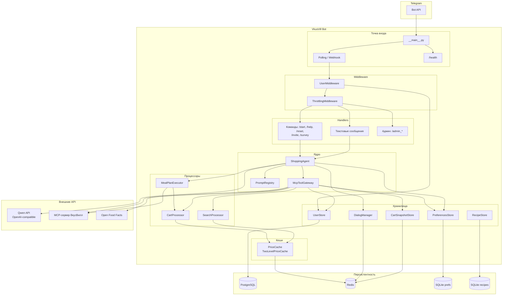
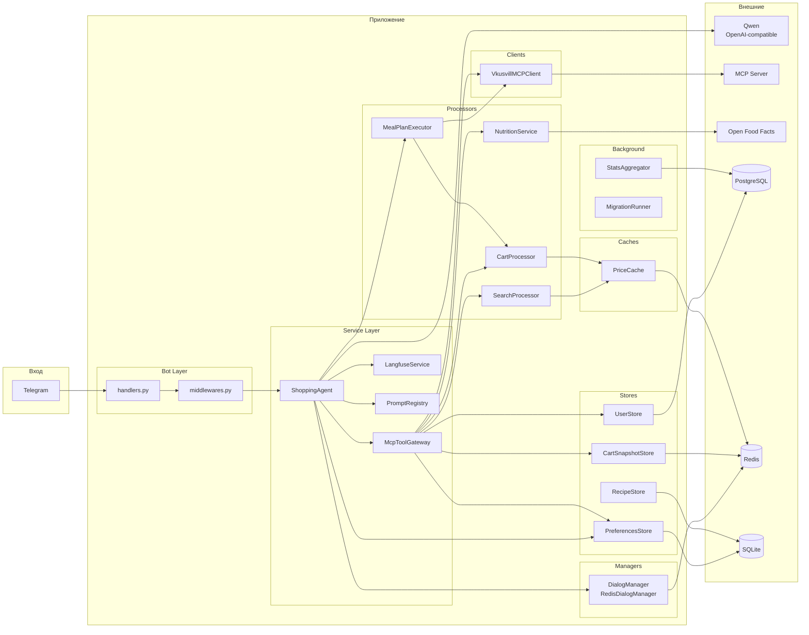
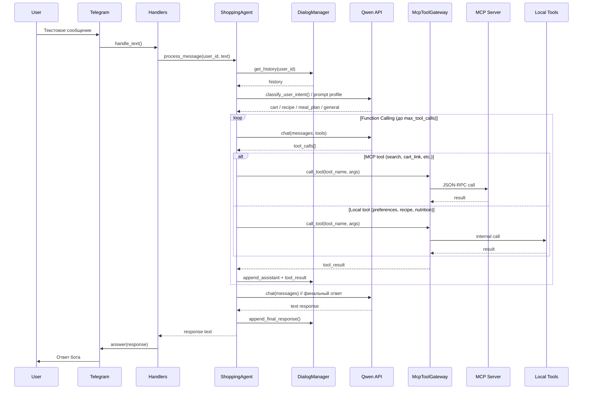
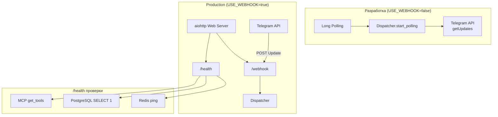
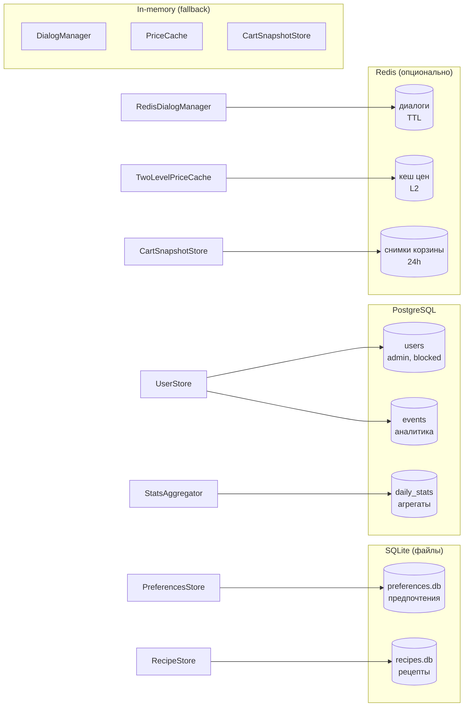
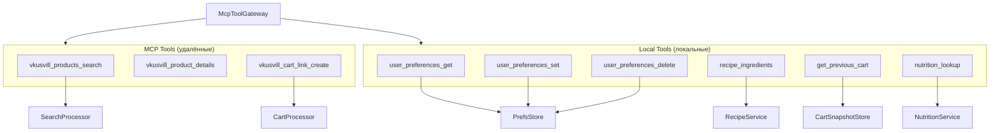

# Архитектура VkusVill Bot

Mermaid-диаграммы и краткие пояснения по текущей архитектуре проекта.

---

## Общая схема (C4 Context)



---

## Поток данных (уровень контейнеров)



---

## Компоненты и зависимости (детальная схема)



---

## Цикл обработки сообщения (ShoppingAgent + Function Calling)



---

## Поток планирования питания (meal-plan executor)

Meal-plan запросы не идут через общий tool-loop полностью. `ShoppingAgent` сначала строит `TurnState`, определяет `prompt_profile`, проверяет rollout gate и, если пользователь попал в rollout, передаёт turn в `run_meal_plan_turn()`.

```mermaid
flowchart TB
    U[Запрос пользователя\n"план питания на 3 дня"] --> TS[build_turn_state]
    TS --> Gate{profile=meal_plan\nexecutor enabled\nrollout gate passed}
    Gate -->|нет| Loop[Стандартный ShoppingAgent tool-loop]
    Gate -->|да| Parse[LLM-first parse\nmeal-plan-request-extraction]
    Parse --> Req[MealPlanRequest\npeople/days/groups/meal slots]
    Req --> Gen[generate_meal_plan\nschema_version=1]
    Gen --> Validate[Валидация схемы\nдни, слоты, группы, аллергены]
    Validate --> Ingredients[collect_ingredients_for_dishes]
    Ingredients --> Safety[phase2 safety policy\nhard constraints + retry]
    Safety --> Search[search_products_day_by_day]
    Search --> Cart[create_grouped_carts]
    Cart --> Render[deterministic render_response]
    Render --> Trace[Langfuse trace + diagnostics]
```

Ключевые ограничения, подтверждённые кодом:

- `LLM_PROVIDER` поддерживается только как `qwen_openai`; legacy GigaChat runtime удалён.
- Парсинг запроса LLM-first, но при невалидном JSON или исключении используется deterministic fallback из `meal_plan_types.py`.
- Длительность плана ограничена 1..14 днями, количество людей — 1..20.
- Явно запрошенные приёмы пищи (`breakfast`, `lunch`, `dinner`, `snack`) для одной группы дают точное число слотов: `days * len(requested_meal_types)`.
- Генерация принимает только `schema_version=1`, уникальные блюда, валидные `day`, `meal_type`, `servings_total` и `audience_groups`.
- Для планов от 5 дней включаются extended deadlines: 240 секунд на turn и 210 секунд на phase2.

Операционные сигналы:

- Langfuse spans: `meal-plan.parse-request`, `meal-plan.collect-ingredients`, `meal-plan.phase2-safety`, `meal-plan.search-products`, `meal-plan.create-cart`.
- `get_last_turn_diagnostics()` содержит статистику `meal_plan_ingredient_collection`, `meal_plan_recipe_search`, `meal_plan_cart_create`, а также причину executor gate.
- Если executor не может безопасно завершить flow, он возвращается в стандартную обработку с префиксом `Перехожу к стандартной обработке запроса`.

---

## Режимы работы (Polling vs Webhook)



---

## Хранилища данных



---

## Инструменты (Tools) McpToolGateway



---

## Легенда

| Компонент | Назначение |
|-----------|------------|
| **ShoppingAgent** | Оркестрация Qwen, prompt routing, function calling, история диалогов |
| **McpToolGateway** | Маршрутизация MCP vs local tools, таймауты, retry и нормализация вызовов |
| **SearchProcessor** | Поиск товаров, кеш цен, постпроцессинг результатов |
| **CartProcessor** | Сборка корзины, верификация, расчёт стоимости |
| **MealPlanExecutor** | Выделенный pipeline планов питания: парсинг запроса, генерация меню, поиск ингредиентов, корзина |
| **DialogManager** | Хранение истории диалога (in-memory или Redis) |
| **PreferencesStore** | Предпочтения пользователя (SQLite) |
| **UserStore** | Пользователи, админы, блокировки, рефералы (PostgreSQL) |
| **VkusvillMCPClient** | JSON-RPC клиент к MCP-серверу ВкусВилл |
| **PriceCache** | Кеш цен (in-memory или L1+L2 с Redis) |
